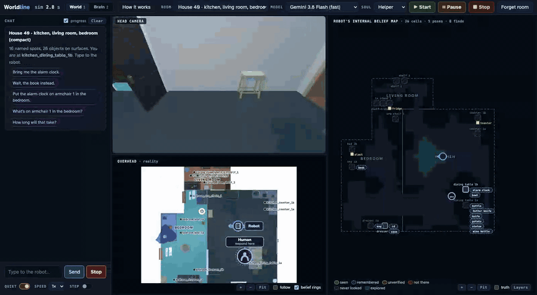
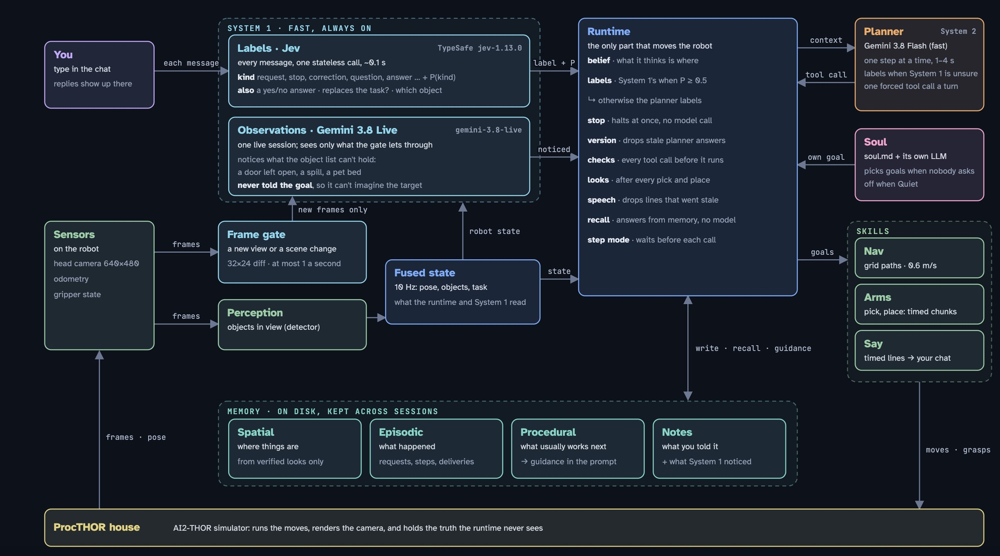
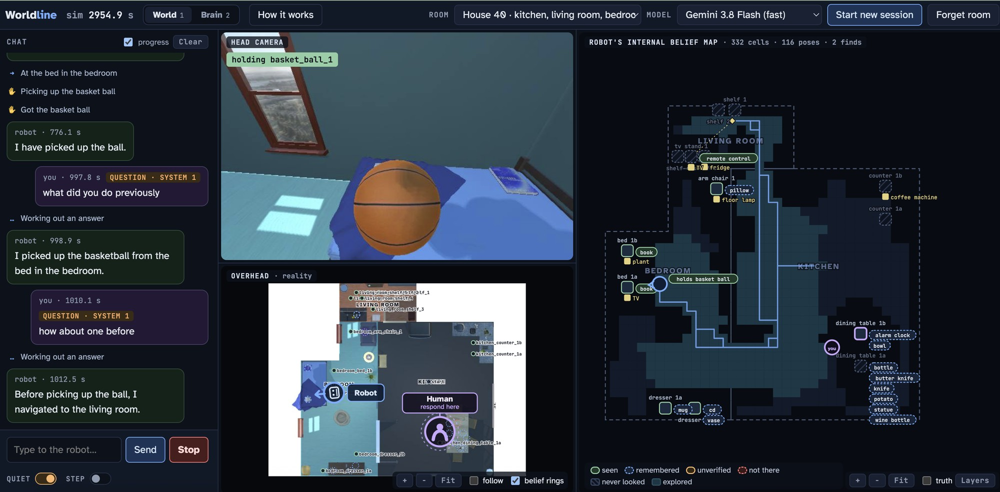

# Worldline runtime

A runtime for a home robot that fetches things, moves them where you ask, and answers
questions, running in a simulated house (AI2-THOR, ProcTHOR). You type to the robot, and a
web page shows what it sees, what it believes and every model call it makes.



*A 75-second run at 2.5× speed: "Bring me a book", "No, the alarm clock instead", Stop, "Okay,
carry on", the delivery, then Pause and the Brain tab. [Full video (MP4)](docs/images/demo.mp4).*

- **System 1** is fast and always on. It labels every message (Jev, about 0.1 s) and notices
  things in the camera (Gemini 3.8 Live).
- **System 2**, the planner, picks one step at a time (Gemini 3.8 Flash).
- **The runtime** sits between them and the robot. It checks every step before anything
  moves, keeps what the robot believes separate from what is true, works out where things
  are relative to each other, and checks that a task really ended the way you asked.

## Features

- **Two speeds of thinking.** System 1 (Jev) labels every message in about 0.1 s; System 2 (the
  planner) decides one tool call at a time.
- **You can interrupt it.** "Stop" halts the motors before any model answers. Corrections cancel
  the old task; a request Jev marks as replacing the task does too; additions and questions
  leave running actions alone. Answers decided for a request you've since changed are dropped.
- **Belief, not truth.** The planner only sees what the robot believes. Every pick and place is
  checked with a look, and where you said something should go is checked against the layout.
- **Rules in code, not in the prompt.** Every tool call is checked before it runs, and a rejection
  goes back to the planner with the reason.
- **Memory across sessions:** spatial (where things are, from verified sightings), episodic (what
  was asked and delivered), procedural (what usually comes next) and notes. `recall` answers
  from memory without a model call.
- **Camera observations.** Gemini 3.8 Live gets a head-camera frame only when the view is new or
  the scene changed, and notices what the object list can't hold (an open door, a spill).
- **A soul.** When nobody's asking, the robot can pick goals of its own, from a soul file: Helper,
  Chatty, Cleaning, Security, or a custom one Gemini writes from your description.
- **Everything visible.** The page shows the camera, the house from above, the robot's belief
  map, and every model call: the exact text each model got, what it answered, and for Gemini
  Live, the frames it was shown.
- **Session controls.** Start, Pause, Stop, Speed (1×, ½×, ¼×) and Step mode.
- **An evaluation suite.** 17 scripted conversations scored against the simulator's truth, and
  deliberately broken runtimes (`agent/mutants.py`) to show each safeguard matters.

## Architecture



### A message, end to end

1. **Label.** Every message goes through System 1, "stop" included. Jev labels it: a new
   request, a correction, a stop, a question, an answer, and so on, with a probability, plus
   whether it replaces the current task and which object it's about. The runtime uses the
   label when its probability is at least 0.5; otherwise the planner classifies.
   - **"Stop" never waits for a model.** The motors halt the moment the message arrives;
     Jev's label follows (the chat shows `stop · System 1 · halted first`).
   - **A correction cancels** what's running for the old request.
   - **A new request while the robot is busy** is queued for the planner, unless Jev is sure
     it replaces the task ("Never mind the book, get me the alarm clock"); then it cancels
     like a correction.
2. **Decide.** The planner gets one prompt built from belief, never from the simulator.
   It sees:
   - the map, and a **layout** worked out in code, e.g. `stove_1 is between counter_1a
     and counter_2`;
   - the conversation, what the robot believes is where, and where it has looked;
   - notes you gave it, and what System 1 noticed;
   - recent actions, and a hint learned from past tasks.

   It answers with exactly one tool call: `navigate`, `look`, `reachability`, `pick`,
   `place`, `say`, `recall` or `wait`.
3. **Check.** The runtime checks every call against its rules before anything moves.
   For example: pick needs a fresh reachability check, and the hand must be known to be
   empty. A rejected call goes back to the planner with the reason. An answer made for a
   request you have since changed is dropped.
4. **Act and verify.** Skills run in the background, so the robot keeps listening while
   it moves. After every pick and place it looks, because a success flag is only a claim.
5. **Goal check.** When you said where something should go ("the other side of the
   stove"), the place carries that relation. The runtime checks where the object really
   landed against the layout. A miss goes back to the planner ("move it there or tell the
   user"), never a false "done".
6. **Remember.** Memory is saved per house and carries over to the next session:
   - **Spatial:** where things are, from verified sightings only.
   - **Episodic:** what was asked and delivered.
   - **Procedural:** which step usually comes next.
   - **Notes:** what you told it, and what System 1 noticed.

   The planner reads memory with `recall`, which answers locally with no model call.

When nobody needs anything, the robot's **soul** can pick goals of its own: a markdown file in
`personas/` says who it is, and its own LLM reads that (and what the robot believes) to decide
what it wants to do. The planner carries it out under the same rules as any request. It starts
quiet; the Quiet switch under the chat lets it act.

More detail, with sequence diagrams and every rule: [docs/architecture.md](docs/architecture.md).

## The planner

The planner (`agent/model.py`, Gemini 3.8 Flash) decides one step at a time. Each turn it gets a
system prompt (the world, how to find things, how to deliver, the rules) and one text the runtime
builds from belief, and it must answer with **exactly one tool call**: the client forces it
(Gemini function calling mode `ANY`), and the tool schemas list only the spots on the map and
the object ids in belief as valid values.

**What it reads each turn**, in this order: `TIME` and the current request version, `MAP`
(spots, surfaces, rooms, people), `LAYOUT` (what is next to what, worked out in code),
`CONVERSATION`, `BELIEF` (only what matters now), `LOOKED AT`, `NOTES` (what you told it),
`NOTICED` (what System 1 saw, unverified), `ACTIONS` (recent, with results; late ones marked),
`RUNNING NOW`, `LEARNED FROM PAST TASKS` (procedural guidance), `OWN GOAL` (from the soul) and
`NOTE` (why its last call was rejected). It never sees the simulator.

**Its tools** (`brains/interface.py`):

| Tool | Arguments | Kind | What happens |
|---|---|---|---|
| `say` | `text` | speech | Queued and played in order; doesn't block anything. Dropped if it repeats the last line, or if nobody asked for anything. |
| `recall` | `query` | memory | Answered locally from memory, instantly, no model call; the answer comes back in `ACTIONS` and the planner is asked again. |
| `look` | | sense | Scans the surfaces at the current spot and both hands; updates belief. The planner is asked again when it's done. |
| `reachability` | `object` | sense | Can it be picked from here, and with which arm. Required before every pick. |
| `navigate` | `to` (a spot) | body | Drives there in the background; the robot keeps listening. |
| `pick` | `object`, `arm` | body | Grasps in timed chunks; a cancel lands between chunks. Followed by a look to verify. |
| `place` | `object`, `arm`, optional `goal` | body | Puts it on the surface in front. `goal` ("other side of stove_1 from counter_1a", "next to X", "between X and Y"...) is checked against the layout after the place. |
| `wait` | | | Nothing to do until something changes: you speak, or an action finishes. |

**How a turn runs** (`Runtime._think` in `agent/harness.py`):

1. Ask the planner (20 s timeout). If you changed the request or said stop while it was
   thinking, the answer is dropped as stale.
2. `say` and `recall` are handled at once, and the planner is asked again.
3. Every other call is **checked** first. A rejection goes back to the planner as `NOTE` with
   what to do instead; after three in a row the runtime stops asking until something changes.
4. A sense call (`look`, `reachability`) runs, and the planner is asked again with the result.
5. A body call (`navigate`, `pick`, `place`) starts in the background and the turn ends; the
   planner is asked again when it finishes or you say something. After a pick or place the
   runtime looks on its own, because a success flag is only a claim.

Up to 40 decisions per wake-up. **The checks** include:
- `pick` needs a successful `reachability` from this spot, with the arm it named, and a hand
  known to be empty; two failed grasps of the same object mean tell the user instead.
- `place` needs the hand verified to hold the object, and a surface at this spot; a `goal` must
  parse into one of the layout's relations.
- `navigate` needs a known spot; a spot that couldn't be reached twice means tell the user.
- No body action while you've said stop, while another one is running, or when nobody asked for
  anything and there's no own goal. While cancelled actions are being settled, it waits.
- An own goal (from the soul) may use only the tools its soul allows.

**Labels:** when System 1 isn't confident (or isn't running), the planner labels the message:
first by rule ("stop"; "go ahead" while paused; a short answer right after the robot asked a
question), otherwise with one forced `classify` call. If that fails or times out (8 s), keywords
decide.

## Memory

Memory is saved per house and carries over to the next session. Only the runtime writes it,
and only from verified belief: a model's claim never becomes memory.

| Memory | Stored in | Written | Read |
|---|---|---|---|
| **Spatial**: where things are, and where they usually are | `runs/memory/<house>.json` | whenever verified belief changes (10 Hz loop), and when the session ends | loaded into belief at session start as *remembered* (unverified: go and look); `recall` |
| **Notes**: what you told it ("my keys are usually on the counter") | the same file, up to 30 | when a message is labelled an observation | `NOTES` in every prompt; `recall` |
| **Noticed**: what System 1 saw that the object list can't hold | the same file, up to 40 | after each Gemini Live observation | `NOTICED` in the prompt (unverified hints); the Memory tab |
| **Episodic**: what happened, session by session | `runs/episodes/<house>/<stamp>.jsonl` | every event as it happens (a crash still leaves a record): what you said and how it was labelled, decisions, actions and results, deliveries, corrections, stops, own goals | `recall` ("what did I ask for last time"); the procedural graph |
| **Procedural**: what usually works next | `runs/procedures.json` | recounted at start from the last 200 sessions | `LEARNED FROM PAST TASKS`: up to three next steps for the step the task is at |

**Spatial** keeps each object's last 8 sightings, so it knows where a thing *usually* is, not only
where it was last. Each object has a status: `seen` (on a surface), `held` (in a hand), `missed`
(looked for and not there: a stable thing keeps its place once), `moved` (missing again, or a
thing that moves around: no current place, but the usual place remains). It also keeps landmarks
(the fridge, the stove) and which spots were looked at, and when.

**Procedural** is a graph of steps (`navigate:ok`, `reachability:not_seen_here`, `pick:ok`,
`say`...) with edges counted from tasks that ended well or badly; an edge needs at least two tasks
behind it before it's suggested. Short learned rules ("after place:ok, say") can be proposed by a
model comparing failed and successful tasks, and are used only once they survive a scenario-suite
run without making it worse (`eval/evolve.py`). The graph only suggests; the runtime's rules
still decide.

### Recall

`recall(query)` lets the planner ask memory instead of carrying all of it in every prompt
(`agent/recall.py`). It answers locally and instantly from belief, spatial memory, notes and the
episode log, with no model call and nothing moving, in at most 1,100 characters:

| Query | Answer |
|---|---|
| `recall("mug")` | where the mug is (seen when), where it was, and where it usually is |
| `recall("kitchen")` | what's known to be in the kitchen, surface by surface |
| `recall("keys")` | also the notes you gave it that mention keys |
| `recall("what did I ask for last time")` | requests and deliveries from earlier sessions |
| `recall("counter_1a")` | what's on it, and what it's next to (the layout) |

## The robot API

The runtime drives the robot only through this interface (`thor/robot.py`, here backed by
AI2-THOR), so a real robot can stand in by implementing the same calls:

| Call | Returns |
|---|---|
| `lookup_keypoints()` | the map: spots, the surfaces reached from each, rooms, people, and path lengths between spots |
| `perception()` | what the head camera sees now: objects, landmarks and people in view, with labels and positions |
| `telemetry()` | base pose and motion, gripper and arm state |
| `send_goal(skill, **args)` | a goal: `goal.cancel()` requests a cancel, `await goal.result()` gives `SUCCEEDED`, `ABORTED` or `CANCELED` with data. Raises `GoalRejected` if it can't start. |
| `halt()` | the hardware stop: base and arms freeze at once; running motion ends `ABORTED` |
| `events()`, `active_goals()`, `idle()`, `shutdown()` | the event stream, what's running, and teardown |

| Skill | Arguments | Result data | A cancel... |
|---|---|---|---|
| `navigate` | `to` | `at`; or `reason` (`no_path`, `halted`) | stops at the next grid point (every 0.25 m), maybe between spots |
| `look` | `glance` (optional) | `at`, `surfaces` (what's on each), `landmarks`, `hands` | stops at once |
| `reachability` | `object` | `reachable`, `arm`; or `reason` (`not_seen_here`, `too_far`, `hand_full`...) | stops at once |
| `pick` | `object`, `arm` | `holding`; or `reason` (`grasp_failed`, `halted`) | waits for the running chunk (about 1 s); a cancel during "close" still ends holding it |
| `place` | `object`, `arm` | `surface`; or `reason` (`no_surface_here`, `no_room_on_surface`) | waits for the running chunk |
| `say` | `text` | `played` (seconds, when cut off) | cuts off at once |

`agent/skills.py` wraps each skill with a timeout (navigate: from the path length; look and
reachability 12 s; pick 15 s; place 12 s), adding `TIMEOUT` and `REJECTED` to the statuses.

In the simulator, `perception()` reports the objects actually in the head camera's view, with
exact labels: a stand-in for a detector. The runtime never sees anything beyond that.

## Set up and run

You need Python 3.11 and two keys:

| Key | Used by | Get one |
|---|---|---|
| `TYPESAFE_API_KEY` | System 1's labels (Jev) | [typesafe.ai](https://typesafe.ai) |
| `GEMINI_API_KEY` | the planner (Gemini 3.8 Flash), the soul, and System 1's observations (Gemini 3.8 Live) | [Google AI Studio](https://aistudio.google.com/apikey) |

Tested on macOS (Apple Silicon).

```bash
git clone https://github.com/nirtyj/worldline-runtime
cd worldline-runtime
python3.11 -m venv .venv-thor
.venv-thor/bin/pip install -r requirements.txt

cat > .env <<'EOF'
TYPESAFE_API_KEY=your-typesafe-key
GEMINI_API_KEY=your-gemini-key
EOF
# .env is never committed

SYSTEM1=brains.system1_jev:create .venv-thor/bin/python ui/server.py
```

Then open http://localhost:8765. The first start downloads the simulator (about 775 MB,
kept in `~/.ai2thor`) and the ProcTHOR house (kept in `runs/procthor/`), so it takes a few
minutes; later starts take seconds.

Command-line options: `--port`, `--scene` (`FloorPlan10` is a single kitchen), `--soul`
(`robot`, `robot_chatty`, `robot_cleaning`, `robot_security`), `--soul-file` (a custom soul)
and `--speed` (e.g. `0.5`). The page changes all of these too.

### System 1

System 1 is a plug-in, chosen with `SYSTEM1` (the contract is `System1` in
`brains/interface.py`):

| `SYSTEM1` | Labels | Observations | Keys |
|---|---|---|---|
| `brains.system1_jev:create` | Jev | Gemini 3.8 Live | TypeSafe + Gemini |
| `brains.system1:create` | Gemini 3.8 Live | Gemini 3.8 Live | Gemini |
| `tests.system1_stub:create` | fixed answers, for testing the wiring | none | Gemini |
| unset | the planner | none | Gemini |

## The page



- **World (key 1):** the head camera, with what the robot is doing overlaid. Below it, the
  house from above (reality). On the right, the robot's internal belief map.
- **Brain (key 2):** the live feed and every model call, with the exact text the model got
  and what it answered. Side tabs: Now, State (truth vs belief), Memory and Procedures.
- **How it works (H):** the whole system on one page.

The chat is on the left in both tabs. Each of your messages shows its label and who gave it
(`correction · System 1`). In **Brain → Model calls**, every call is listed: the planner's, the
soul's, Jev's labels and Gemini Live's observations. Click one to see the exact input, the
answer, what the runtime did with it, and for an observation, the frames Gemini Live was shown.

### What the controls mean

**In the header**

- **▶ Start** begins a new session in the chosen room with the current settings. While paused,
  it reads **▶ Resume**.
- **⏸ Pause** freezes sim time: nothing moves, speaks or decides until you resume. A model call
  already on its way still comes back.
- **■ Stop** ends the session: the robot stops, its memory is saved, and no more model calls are
  made. (The Stop under the chat is different: it stops the robot, not the session.)
- **Room** and **Model** pick the house and the planner model for the next Start.
- **Soul** picks who the robot is when nobody's asking (below). It changes at once; whatever the
  old soul was doing is dropped. **✎** opens the custom soul editor.
- **Forget room** starts a new session with the robot's memory of this house wiped.

**Under the chat**

- **Stop** sends the word "stop": the robot halts at once, without waiting for any model, says
  "I've stopped" and waits. "Okay, carry on" resumes.
- **Quiet** decides whether the robot does things on its own.
  - On (the default): it only does what you ask. It still hears, answers and carries out
    requests, but its soul starts nothing.
  - Off: when nobody has needed anything for 8 seconds, its soul (its own LLM, reading the soul
    file and what the robot believes) may pick something to do: look around, tidy, patrol, check
    in. The planner carries that out under the same rules as your requests. The moment you say
    anything, it drops it: you always come first.
- **Speed** (1×, ½×, ¼×) slows walking, looking and speaking so you can talk over it. The models
  still answer at their own pace, so at ½× the robot seems to think twice as fast.
- **Step** holds every planner call until you press Step (or N), so you can read each decision
  before it's made. The robot finishes what it's doing meanwhile, and Stop still works.

### Souls

A soul is a markdown file: a short header (the tools its own goals may use, how often it
thinks, where things belong) and a few paragraphs, in the first person, about who the robot is.
It only matters when Quiet is off.

| Soul | File | When nobody's asking |
|---|---|---|
| Helper | `personas/robot.md` | Keeps its picture of the home fresh, and puts obviously misplaced things back. |
| Chatty | `personas/robot_chatty.md` | Checks in, and tells you what it noticed, in one short line at a time. |
| Cleaning | `personas/robot_cleaning.md` | Goes room by room and puts things back where they belong. |
| Security | `personas/robot_security.md` | Patrols, looks at what it checked least recently, and reports what changed. Moves nothing. |
| Custom… | written on the page | Whatever you describe. |

**A custom soul:** pick **Custom…** in the Soul menu (or press ✎), describe the robot in a
sentence or two ("a grumpy old butler who keeps the kitchen spotless and grumbles about mugs
left in other rooms"), and press **Write the soul**. Gemini writes it in the same format as the
files above; edit it if you like, then press **Use this soul**. It stays in the menu until the
server restarts. From the command line, `--soul-file my_soul.md` loads one at start.

## Things to try

- "Bring me the alarm clock." Then watch the camera, the belief map and the model calls.
- Mid-task: "No, the book instead." or "Stop", then "Okay, carry on."
- "Never mind the book, get me the alarm clock." while it's fetching the book.
- In Kitchen 10: "Move the spatula to the other side of the stove." It works out counter 2
  from the layout and checks it after the place.
- "Put the spatula in the cup." It says it can't put things into containers yet, instead
  of putting it on the counter and saying it's done.
- "Where did you put the alarm clock last time?" It answers from memory.
- "My keys are usually on the kitchen counter." It keeps the note.
- Turn Quiet off and pick the Security or Cleaning soul, then leave it alone for a minute.
- Write a custom soul, turn Quiet off, and see what it decides to do.
- Open Brain → Model calls and click a "System 1 notice" to see the frames Gemini Live was shown.

## Tests

```bash
# unit tests: no simulator or keys needed
.venv-thor/bin/python -m unittest discover tests

# the scenario suite: 17 scripted conversations against a running server,
# scored against the simulator's truth
.venv-thor/bin/python eval/suite.py
.venv-thor/bin/python eval/suite.py --only correction,stop_resume,hold_on,replace_task
```

The scenarios cover:
- fetching, including from another room and after a search;
- corrections, replacing and adding tasks, stop and resume, "hold on";
- remembering where things are and what was asked;
- notes, questions mid-task, and requests it can't do;
- camera observations, learned procedures, and asking permission to explore;
- the other side of the stove.

## Repository

```text
agent/        the runtime: harness.py (loops, rules, stop lane, goal check), state.py (belief),
              layout.py (what is next to what; relations), fused_state.py (10 Hz fusion),
              skills.py (speech queue, skills), model.py (planner prompt), memory.py,
              episodes.py, procedures.py, recall.py, soul.py (the robot's soul: a personas/*.md
              file + its own LLM), persona.py (the older rule-based own goals),
              narrator.py (progress lines in the chat), mutants.py (one safeguard removed each)
brains/       interface.py (kinds, tools, the System 1 contract), composite.py (System 1's label
              when confident, else the planner), system1_jev.py (Jev labels + Gemini Live
              observations), system1.py (Gemini 3.8 Live for both), frame_gate.py
personas/     the robot's souls: robot.md, robot_chatty.md, robot_cleaning.md, robot_security.md
llmkit/       model clients
thor/         world.py (the house, the simulator), robot.py (sensors, nav stack, arms, say),
              procthor.py (ProcTHOR-10K houses)
ui/           server.py (the page's server; feeds System 1), index.html,
              views/ (belief map, memory, the How it works diagram), robot_map.py, recorder.py
eval/         suite.py (17 scenarios), evolve.py (learn procedural rules), system1_load.py,
              system1_routes.py (System 1 latency and label checks)
tests/        unit tests, and system1_stub.py (a System 1 stand-in with fixed answers)
baseline/     a naive sequential runtime, for contrast
sim/          clock (one clock for everything; speed and pause), event log, goals
runs/         memory/, episodes/, procedures.json, eval/, procthor/ (not committed)
```

## License

Copyright © 2026 Nirtyanath Jaganathan. All rights reserved. The code is public so you can read it and run it to
try it out; please ask before reusing, modifying or redistributing any part of it. See [LICENSE](LICENSE).
