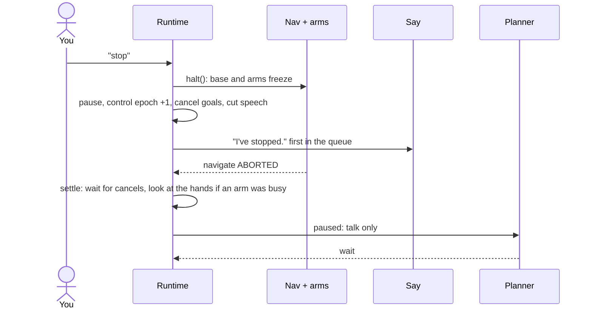

# How the robot runtime works

This is a runtime for a home robot that fetches things and answers questions. You
type to it; it answers in the chat, drives around a house, picks things up and puts
them down. Two models help it think. System 1 is fast and always watching: it labels
every message and notices things in the camera. System 2, the planner, decides each
step. The runtime owns what is true: it decides what counts as seen, checks every
step before the robot moves, runs the skills, and remembers what happened. A ProcTHOR
house in the AI2-THOR simulator stands in for the real world.

```bash
.venv-thor/bin/python ui/server.py        # then open http://localhost:8765
```

## The robot

Everything in the big box would run on the robot. Here it runs in `ui/server.py`,
and the page is a window into it.

```
                  ┌─ SYSTEM 1 (fast, always on) ──────┐      ┌─ SYSTEM 2: PLANNER ───────────────┐
                  │ labels every message: kind,       │      │ Gemini 3.8 Flash, or Claude       │
                  │ target, yes/no, confidence        │      │ one tool call a step              │
                  │ notices things in the frames      │      └──────▲──────────────────┬─────────┘
                  └──▲──────▲──────────▲──────┬───────┘        context (text)     one tool call
                message  frames   fused state │ label · noticed      │                  │
┌──────────┐  ┌─ THE ROBOT ──────────────────┼────────────────────────┼──────────────────┼─────────┐  ┌───────────┐
│ YOU      │  │     │      │          │      ▼                        │                  ▼         │  │ ProcTHOR  │
│ type ────┼──┼─────┘      │          │  ┌─────────────────────────────┴──────────────────────┐    │  │ house     │
│          │  │ HEAD CAMERA┴► PERCEPTION ─┐│ RUNTIME  agent/harness.py                          │    │  │ (AI2-THOR)│
│          │  │ BODY SENSE ───────────────┴► FUSED STATE (10 Hz) ─► belief · rules · stop lane │    │  │ renders   │
│          │  │                            │ speech queue · persona · narrator · memory         │    │  │ frames,   │
│          │  │                            └───────┬──────────────┬──────────────┬────────────┘    │  │ moves the │
│ read ◄───┼──┼──── chat ◄── SAY ◄─────────────────┘   NAV STACK ◄┘      ARMS ◄──┘                 │  │ body      │
└──────────┘  └──────────────────────────────────────────────────────────────────────────────────┘  └───────────┘
```

Perception (what objects are in view) and body sense (pose, grippers) are fused ten
times a second, the fused state updates belief, and the planner reads belief as
text. System 1 gets the same fused state and the head camera's frames, so it can
label messages in context and notice what the object list can't hold. What it says
is only ever a label or a hint: the runtime decides. The planner never sees an image,
and the simulator's ground truth reaches the robot only through its sensors.

The runtime is a set of asyncio loops that share one belief and one clock:

| Loop | What it does |
|---|---|
| listen | Takes each message. "stop" halts the robot here, before any model call. |
| interpret | Asks the planner what kind of message it is, and applies that kind. |
| think | Asks the planner for the next step, checks it, dispatches it. |
| speech | Plays queued lines one at a time. |
| observe | Ten times a second: fuse sensors, update belief, save memory, wake the planner if something new was seen while idle. |
| persona | When nobody needs anything, gives the robot a small goal of its own. |
| System 1 feed | In the server: sends System 1 the fused state when it changes, each new camera frame (at most one a second; nothing while the view is still), and what the robot says; asks it what it noticed every few seconds and right after an arrival or a look. |

## From a message to an action

Every message goes through System 1 first, "stop" included.

**Stop first.** If the message is "stop" (or "freeze", "halt"), the runtime halts the
motors the moment it arrives, before any model answers. System 1 then labels it as
usual, and the runtime notices it is already stopped, so there is no second "I've
stopped." System 1 also catches stops the keyword misses ("hold on", "wait wait").

**Label (System 1).** System 1 returns the message's kind, the object it is about,
whether it replaces the current task, a yes or no if it answers the robot's question,
and how confident it is. The runtime uses the label when the kind is valid and the
confidence is at least 0.5. Otherwise, or if System 1 takes longer than 2 s or isn't
running, the planner classifies the message instead. A few messages the planner's
side labels by rule without a model call: "go ahead" while paused, and short answers
right after the robot asked something. Either way the runtime decides what the kind
does:

| Kind | Example | What the runtime does |
|---|---|---|
| request | "Bring me the mug." | Becomes the goal. A new request version, unless the robot is still busy. While busy, a request System 1 confidently marks as replacing the task ("Never mind the book, get me the alarm clock") is handled like a correction. |
| correction | "No, the alarm clock instead." | Version goes up, actions for the old version are cancelled, their queued speech is dropped. |
| addition | "Also grab a napkin." | Nothing is cancelled; the planner fits it in. |
| question | "How long will that take?" | Nothing is cancelled; the planner answers. |
| stop | "Stop." | Halt at once (see below). Never waits for a model. |
| resume | "Okay, carry on." | Unpause; decisions made while paused are dropped. |
| answer | "The blue one." | Answers the robot's own question. |
| constraint | "Don't go into the bedroom." | Keeps running motion, drops decisions made without it. |
| observation | "My keys are usually on the counter." | Kept word for word as a note. |
| chitchat | "Thanks!" | Nothing to do. |

**Decide.** The think loop asks the planner for exactly one tool call at a time.
The prompt is built from belief, never from the simulator:

| Prompt section | Contents |
|---|---|
| time, request version, goal | where the task stands |
| MAP | rooms and their spots, the surfaces with their heights, where to deliver |
| LAYOUT | what is next to what: each line of surfaces left to right as you face it, what each landmark seen sits between, which lines face each other |
| CONVERSATION | what you said and what the robot said; lines still needing a reply are flagged |
| BELIEF | the objects that matter now, plus a count of what else is in memory |
| LOOKED AT | which spots it has looked at, and when |
| NOTES | what you told it about the home |
| NOTICED | what System 1 noticed in the camera, marked unverified |
| ACTIONS | recent actions and results, including recall answers |
| RUNNING NOW | what is in progress |
| LEARNED FROM PAST TASKS | a hint from the procedural graph for this step |
| OWN GOAL | the persona's goal, when idle |
| NOTE | why the last call was rejected, if it was |

With Gemini 3.8 Flash (thinking off) a decision takes about 1.3 s and about 4,200
input tokens.

**Check.** An answer can be out of date by the time it arrives. It is dropped if the
request version or the control epoch changed while the planner was thinking, if it
repeats the last line with nothing new heard, or if it speaks when nobody has spoken
and no own goal asks it to. Then the call is checked against the rules below; a
rejected call goes back to the planner as a NOTE saying what to do instead.

**Dispatch.** Speech goes to the queue. `look`, `reachability` and `recall` run at
once. `navigate`, `pick` and `place` run in the background, so the runtime keeps
listening and thinking while the robot moves. When one ends, its result updates
belief, and after every pick and place the runtime looks, because a success flag is
only a claim. It first glances straight ahead (a nod, no turning, about 0.3 s). A
glance only adds what it sees; if it didn't show the placed object (behind the coffee
machine, say), the runtime does the full look.

**Goal check.** When a request says where something should end up, the planner passes
that relation with the place (`goal="other side of stove_1 from counter_1a"`). After
the place and its look, the runtime checks where the object really is against the
layout (`agent/layout.py`: on, next to, left or right of, between, the other side of,
across from, near). A miss goes back to the planner as a NOTE ("move it there, or tell
the user; don't say it's done"), and the chat says "Not right yet: …". This is the
VeriGraph idea: check the result against the relation asked for, not against the
planner's say-so. "In the cup" can't be done yet (the robot can't put things into
containers), so the planner says so instead.

## The tools

| Tool | Arguments | What happens |
|---|---|---|
| `say` | text | Queued, tagged with the request it serves. Takes about 0.3 s plus 0.32 s a word; shown in the chat. |
| `navigate` | to: a spot | Breadth-first path over a 0.25 m grid of walkable floor, 0.6 m/s. A cancel stops at the next grid point; a halt stops at once. |
| `look` | | A scan: three headings at two tilts, plus straight ahead at shelves, about a second. Belief learns what is on the nearby surfaces and in the hands. |
| `reachability` | object | Whether the object can be picked from here, and with which arm. |
| `pick` | object, arm | Timed chunks: approach, pregrasp, close, lift. A cancel is honoured between chunks. |
| `place` | object, arm | Lower, open, retract, on the stretch of surface in front of the robot. |
| `recall` | query | Asks memory, instantly and without moving. |
| `wait` | | Nothing, until you speak or an action ends. |

The rules every call must pass (`_check` in `agent/harness.py`):

| Rule | Rejected with |
|---|---|
| The spot must exist | "unknown keypoint …; use one of: …" |
| One body action at a time | "already running navigate; wait for it to finish" |
| No moving while stopped | "the user said stop: … wait until they say to continue" |
| No moving without a request or an own goal | "nobody has asked for anything … call wait" |
| An own goal allows only its own tools | "your own goal (glance) allows only look" |
| The object must be in belief | "unknown object …; use an id from belief (look first)" |
| A pick needs a fresh reachability check from this spot, with its arm | "pick needs a successful reachability check … first" |
| The hand must be known to be empty | "the left hand is not known to be empty; look first …" |
| A place needs the hand verified to hold the object, and a surface here | "the right hand is not verified to hold …; look first" |
| Don't pick up what was just delivered (unless its goal check failed) | "you just put … down and nobody has asked for anything since" |
| A place's goal must be one of the relations, with known ids | "goal … not understood; write it as one of: on X, next to X, …" |
| Two failed grasps or two blocked drives: tell the user | "two grasps of … have failed; tell the user instead of retrying" |

## Belief

Belief is the runtime's working memory. Every fact carries where it came from, when,
and whether it was verified (`Fact` in `agent/state.py`):

| Source | Verified | Meaning |
|---|---|---|
| look / camera | yes | seen: in view this session |
| memory | no | from an earlier session: a hint about where to go |
| skill | no | an action result claimed it (a pick said it succeeded) |
| look_absent | no | looked where it should be and it wasn't there: UNKNOWN |

Something counts as seen when the camera's visibility flag is set, or at least 40
pixels of it are in the frame, within 1.5 m (3 m for appliances such as the fridge,
which are kept as landmarks). This stand-in reads the simulator's object list for
what is in view; a real robot would run a detector. A look that covers a spot and
doesn't see an object there marks it gone from that spot, so "looked and it's
missing" is different from "never looked".

## Memory

Four kinds, from the current moment to every session so far:

| Memory | Where | What it holds |
|---|---|---|
| belief | in the runtime | the current session's facts, as above |
| spatial | `runs/memory/<house>.json` | each object's last 8 sightings, its usual place, whether it moves around, landmarks, spots looked at, your notes |
| episodic | `runs/episodes/<house>/<time>.jsonl` | every session as it happens: what you said, each decision and result, places learned, deliveries |
| procedural | `runs/procedures.json` | which step usually follows which, and how often that went well; learned rules |
| noticed | in `runs/memory/<house>.json` | what System 1 noticed ("the fridge door is open"), with where and how confident, unverified |

**Spatial memory** is written only from verified sightings, and loaded at the next
start as unverified hints: the robot goes where memory says, then looks. When a look
misses something, a thing that stays put (a vase) keeps its place once; a thing that
gets carried around (a mug), or a second miss, is marked moved and keeps only its
history and usual place.

**What System 1 noticed** is kept like your notes: word for word, with the spot and
its confidence, and marked unverified. It never creates or moves an object in belief;
the planner sees it under NOTICED as a hint and confirms with a look before relying
on it. The last 40 are kept per house, and the same thing noticed at the same spot
is refreshed, not repeated.

**Episodic memory** is a log of structured rows. It is what `recall` searches for
"what did I ask for last time", and what the procedural graph learns from.

**Procedural memory** turns each past request into a chain of abstract steps
(`navigate:ok → look → reachability:ok → pick:ok → verify → navigate:ok → place:ok`),
counts transitions and whether the task ended in a delivery, and tells the planner
what usually comes next at the step it is on. A refiner model can propose rules from
failed or slow tasks; a rule is kept only if the scenario suite does no worse with it
(`eval/evolve.py`).

**Recall** is how the planner reads memory without carrying all of it in every
prompt. `recall("mug")` returns where the mug is now, was, and usually is;
`recall("kitchen")` what is known to be there; `recall("what did I ask for before")`
the requests and deliveries of earlier sessions; notes and things System 1 noticed
that mention the query come with it; `recall("stove")` or `recall("layout")` what is
next to what. It answers locally, with no model call.

**Layout** (`agent/layout.py`) is worked out in code, because the planner is good
with names and bad with geometry. From the robot's map (where it stands for each
surface, and each surface's centre) and the landmarks it has seen, it groups surfaces
faced the same way along one axis into lines, puts each landmark on its line, and
orders them left to right as you face them:

```
line 1: fridge_1 (fridge) · toaster_1 (toaster) · counter_1b · counter_1a · stove_1 (stove) · counter_2
line 2: sink_basin_1 · counter_3b
line 1 and line 2 face each other
stove_1 (stove) is between counter_1a and counter_2
```

That makes "the other side of the stove" (from counter_1a) a lookup: counter_2. This
is the scene-graph idea from SayPlan and ConceptGraphs, computed rather than asked of
the model; landmarks the robot hasn't seen aren't placed.

## Stop

"Stop" never waits for a model. It is matched by keyword when the message arrives,
and the motors come first; System 1 still labels it like every other message (the chat
shows "stop · System 1 · halted first"), and the label changes nothing:



Anything the planner decided before the stop is dropped as stale. A correction
takes a similar path without the halt: the old actions are cancelled, any hand a
cancelled arm used becomes UNKNOWN, and nothing but speech starts until the robot
has looked again.

## One request, end to end

A real run in house 40, where memory was out of date:

```mermaid
sequenceDiagram
    actor You
    participant RT as Runtime
    participant Plan as Planner
    participant Mem as Memory
    participant Eyes as Camera + perception
    participant Body as Nav + arms
    participant S1 as System 1
    You->>S1: "Bring me the alarm clock."
    S1-->>RT: request · target alarm clock · 90%
    Plan-->>RT: say("I'll bring you the alarm clock.")
    Plan-->>RT: recall("alarm clock")
    RT->>Mem: search
    Mem-->>RT: last seen on the armchair; usually on the dresser
    Plan-->>RT: navigate(bedroom_arm_chair_1)
    RT->>Body: drive, 0.6 m/s
    Eyes-->>RT: what is in view, 10 times a second
    Plan-->>RT: look
    Eyes-->>RT: not on the armchair
    Plan-->>RT: navigate(bedroom_dresser_1b)
    Eyes-->>RT: alarm_clock_1 on the dresser, seen
    Plan-->>RT: reachability, then pick
    RT->>Body: pick
    RT->>Eyes: look after the pick
    Eyes-->>RT: in the right hand, verified
    Plan-->>RT: navigate(kitchen_dining_table_1b), then place
    RT->>Eyes: look after the place
    Eyes-->>RT: on your table, verified: delivered
    Plan-->>RT: say("Here is the alarm clock.")
```

## The persona

When nobody has needed anything for 8 seconds, the robot's **soul** may give it a goal of
its own, and hands it to the planner as an OWN GOAL with a restricted set of tools. A soul
is a markdown file in `personas/` (who the robot is, plus a short header: the tools its own
goals may use, how often it thinks, where things belong) and its own LLM, which reads that
file and what the robot believes and either intends one concrete thing or rests
(`agent/soul.py`). The page's Soul menu, or `--soul`, picks the file:

| Soul | File | When nobody's asking |
|---|---|---|
| Helper | `robot.md` | keeps its picture of the home fresh, puts obviously misplaced things back |
| Chatty | `robot_chatty.md` | checks in and says what it noticed, one short line at a time |
| Cleaning | `robot_cleaning.md` | goes room by room putting things back where they belong |
| Security | `robot_security.md` | patrols what it checked least recently and reports what changed; moves nothing |
| Custom… | written on the page | the page's soul editor: Gemini writes a soul in this format from a description (`write_soul` in `agent/soul.py`), you edit it and use it; `--soul-file` loads one |

The page starts Quiet: the soul starts nothing. Switching the soul mid-session drops whatever
the old one was doing. An own goal ends when the planner has nothing left to do for it, after
240 s, after 10 s with nothing happening, or the moment you say anything: you always come
first. (`agent/persona.py` holds the shared pieces, such as the own goal and its timings,
and the older rule-based persona a runtime uses when it has no soul.)

## Progress in the chat

The chat shows short progress lines between messages: "Heading to the dresser in the
bedroom, where the alarm clock usually is", "Passing the bed", "Entering the kitchen",
"Found the alarm clock on the dresser", "Noticed: the fridge door is open", "Delivered the
alarm clock to you". They come
from `agent/narrator.py`, which reads the runtime's own trace and the robot's pose on
its map. It makes no model call, and its lines never reach the planner or the speech
queue: they are a status display, not the robot talking.

## The robot's map

The page's map shows only what the robot itself knows (`ui/robot_map.py`): the free
grid its nav stack plans on, the floor its camera has covered, the path it drove and
the route it is on, where it stood when it found things, and belief on each spot. The
dashed house outline comes from the simulator's house file and is only a visual aid;
the robot has no walls or room shapes.

## The page

Two workspaces, keys 1 and 2. The chat, Stop, persona and step mode stay on the left in
both.

| Workspace | What it shows |
|---|---|
| World | the head camera, with what the robot is doing over it (planner thinking, the step running, System 1's last label and what it noticed, each for a few seconds) and what it says as a subtitle; the overhead camera (reality, zoomed to fit the house, with dashed rings where belief puts objects, red where it is wrong); the robot's internal belief map |
| Brain | the live trace and every model call with its full input and output; on the right, tabs for Now (System 1, request, planner, what is running), State (truth vs belief), Memory (spatial memory with each object's history, what System 1 noticed, notes, recalls, earlier sessions, learned rules) and Procedures (the procedure graph) |

**How it works** (H) shows the whole system as one static picture, full screen.

**Step mode** (under Stop) holds every planner call until you press Step, and shows the
text the planner is about to get. The robot finishes what it is doing meanwhile, and
Stop still works.

The server can also run a naive sequential runtime (`baseline/`) and versions of this
one with a single safeguard removed (`agent/mutants.py`), to see what each safeguard
buys (the page always starts the real one; the others go through the `agent` field of
the server's `reset` message): no dropping stale speech, no keyword stop, forgetting a cancelled grasp,
trusting success flags, not waiting for a cancelled chunk, cancelling on every
message, no stale-decision check.

## Plugging in System 1

System 1 is a plug-in, so it can be swapped without touching the runtime. The server
loads it from `SYSTEM1="module:factory"`; the factory gets a status callback and
returns an object with the methods in `brains/interface.py` (`System1`):

| Method | Called |
|---|---|
| `run()` | once, to keep its connection open |
| `route(text)` | for every message; returns kind, target, replaces_task, says_yes, confidence, or None |
| `update(context)` | when the fused state changes (at most once a second) |
| `frame(jpeg, where)` | for each new head-camera frame (at most once a second) |
| `robot_said(text)` | when the robot starts a line |
| `observe()` | every few seconds with new frames, and after an arrival or a look |

Two System 1s are in `brains/`: `system1.py` (Gemini 3.8 Live labels and observations) and
`system1_jev.py` (Jev labels, which need a TypeSafe key, plus Gemini 3.8 Live observations).
`tests/system1_stub.py` is a stand-in with fixed answers for testing the wiring:

```bash
SYSTEM1=tests.system1_stub:create .venv-thor/bin/python ui/server.py
```

With no `SYSTEM1` set, the planner labels every message, as before.

## Testing

`eval/suite.py` drives the running server through 17 scripted conversations and
checks the simulator's truth afterwards: a fetch from another room, a correction, stop
and resume, remembering where something was put, recalling earlier requests, an object
that isn't in the house, a search with memory wiped, a question mid-task, a note, and
something it can't do. Every run also lands in the episode log, so testing feeds the
procedural graph.

```bash
.venv-thor/bin/python eval/suite.py                       # all 17, against a running server
.venv-thor/bin/python eval/suite.py --only correction,stop_resume
.venv-thor/bin/python eval/evolve.py                      # propose rules, keep them if the suite agrees
```

## The simulator

The server's world is AI2-THOR unless `--world module:factory` names another; the
contract is `sim/world.py`, and the robot (`sim/robot.py`) drives any world that meets it.
One server runs one simulator. Stopping the server (Ctrl-C, `kill`, closing the
terminal) stops and reaps it; a simulator left behind by a crash is stopped when the
next server starts; a second server on the same port refuses to start. A simulator
that dies is replaced at the next room load. A load that hangs, including a simulator
that never connects, is retried once on a new one.

## Choices, and what they cost

| Choice | Why | Cost |
|---|---|---|
| One tool call per planner turn | every step is checked and observed | one model round trip per step |
| On a correction, cancel everything from the old request | simple and always safe | wasteful when an old action still serves the new request |
| A hand is UNKNOWN after a cancel until the robot looks | a late result can be missing or wrong | a look per correction |
| Look after every pick and place | success flags lie | about a second per delivery |
| Keyword "stop" before any model | a model call is slower than a stop must be | "stop by the kitchen" would stop |
| Memory as hints, confirmed by looking | things move between sessions | a wasted trip when memory is stale |
| System 1's label used only when valid and confident, and never for stopping the motors | a fast model can be wrong, and a network call is slower than a stop must be | a low-confidence message pays for a second, slower classification |
| System 1's observations stay unverified hints | a vision model sometimes sees what isn't there | the planner may look to confirm something that was right |
| Recall on demand instead of all memory in the prompt | about 4,200 tokens a decision instead of growing with the house | one extra call when it needs memory |

Where it's thin: perception is a stand-in that reads the simulator's object list
(`perception/source.py`; another source plugs in with `--perception`);
appliances are only landmarks, not things it can open; the speech timer is an estimate
with no audio behind it; the procedural graph has few failures to learn from.

## Where each part lives

| Part | Files |
|---|---|
| runtime: loops, rules, stop lane, dispatch | `agent/harness.py` |
| belief, facts, trace | `agent/state.py` |
| fused sensor state | `agent/fused_state.py` |
| speech queue, skill wrappers | `agent/skills.py` |
| planner prompt | `agent/model.py` |
| memory, episodes, procedures, recall | `agent/memory.py`, `agent/episodes.py`, `agent/procedures.py`, `agent/recall.py` |
| persona, narrator | `agent/persona.py`, `agent/narrator.py` |
| runtime/planner contract, tools, kinds, the System 1 contract | `brains/interface.py`, `brains/composite.py` |
| System 1 feed and routing | `ui/server.py` (`_route`, `_system1_feed`), stand-in `tests/system1_stub.py` |
| model clients (Gemini, Anthropic, OpenAI-compatible) | `llmkit/` |
| robot: sensors, nav stack, arms, say | `sim/robot.py` |
| what the robot sees (the stand-in detector) | `perception/source.py` |
| the world seam; a home turned into names | `sim/world.py`, `sim/layout.py` |
| the house and the simulator (AI2-THOR) | `thor/world.py`, `thor/procthor.py` |
| server, page, the robot's map | `ui/server.py`, `ui/index.html`, `ui/views/`, `ui/robot_map.py` |
| scenario suite, rule evolution | `eval/suite.py`, `eval/evolve.py` |
